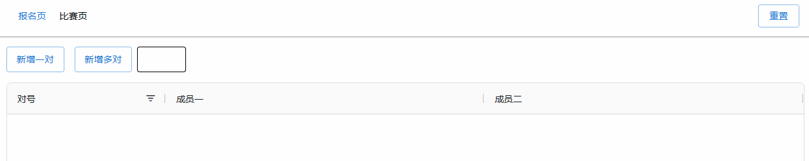
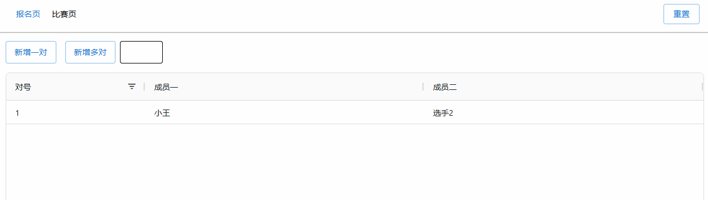
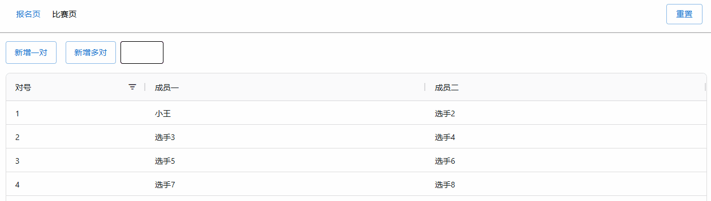
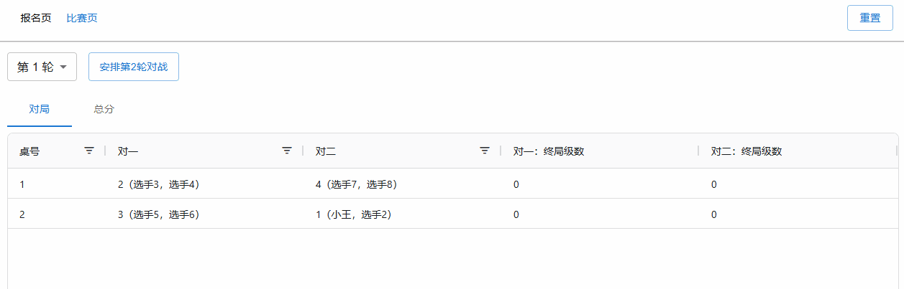
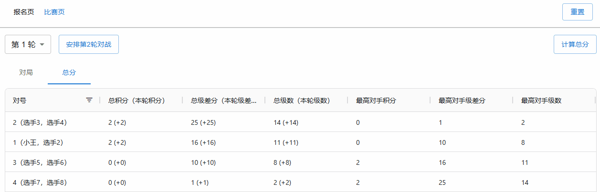

# 掼蛋计分助手

[GitHub](https://github.com/GStarP/guandan-helper)

更新日期：2024-11-01

## 使用指南

[点此加载网页](https://guandan-helper.pages.dev/)

### 报名页

网页加载完毕后，首先进入 `报名页`。在这里，你需要按“对”注册所有选手。

点击左上角“新增一对”可以插入一个新的对。鼠标单击选中选手，按“回车”进入修改模式，修改完成后，按“回车”应用修改。

在输入框输入大于 1 的正整数后点击“新增多对”可以一次性添加多个对。

#### 注意事项

- 请确保对数为偶数！
- 请在报名页完成所有对的注册，比赛过程中创建新的对可能会导致预料之外的结果！
- 对号是最关键的信息，而选手名称不太重要，你可以随时修改。
- 暂不支持删除对，请不要预先创建过多数量的对。

### 比赛页

对注册完毕后，请点击左上角进入“比赛页”，并点击“安排首轮对战”生成第一轮的对局表。

对局表按照桌号排序，对一和对二为同一桌需要对局的两对，以对号表示（也显示了成员名称）

本轮对局完成后，请将每桌两对的最终级数（J 为 11，Q 为 12，K 为 13，A 为 14，过 A 为 15）填写到表格中（同样是 单击选中+回车 进入编辑模式，输入完成后按回车确认）

所有对局结果填写完毕后，左上角点击“总分”栏，然后点击右上角“计算总分”，系统将自动计算总分并将所有对按照分数降序排列。计分分为三项，总分表中展示的是当前轮次及之前所有轮次的计分总和，括号中则是本轮增加的分数（计分规则参见本章节的“注意事项”）

至此，第一轮比赛及计分全部完成，接下来将进入第二轮。点击右上角轮次“安排第2轮对战”，即可生成第二轮对局表。后续重复第一轮的操作（填写终局级数 -> 计算总分 -> 安排下一轮对战），直至轮次达到需求为止。

在比赛的过程中，可以通过轮次选择器查看任一轮次的对局情况和总分排名（请不要忘了，在计算总分和安排下一轮对战时回到最近的轮次！）

#### 注意事项

- 计分规则
  - 积分：对局胜利+2，平局双方均+1，失败+0
  - 级差分：假设双方终局级数为 l1/l2，且 `l1 > l2`，则对一得 `13+(l1-l2)`，对二得 `13-(l1-l2)`（最高级差分为 过A:2 即 26:0）
  - 级数：等同于终局级数。
  - 首先比较积分，积分相同比较级差分，级差分相同比较级数。如果级数也相同，则比较两对遭遇过的对手中，最高的这三项分数。
- 请务必确保所有对局结果填写完毕后再计算总分，即便总分较低的对不再有争夺名次的机会。
- 对局安排规则
  - 采用瑞士轮强对强机制，每次取总分最高的两对进行对局。
  - 确保已经对局过的两对不再重复对局，除非其中一对已经和所有其它对对局过。
- 高阶技巧
  - 考虑到灵活性，表格中的所有内容都是可修改的，计算总分和安排对战也仅仅是一次自动计算并覆盖对应结果。如果在实际对局中你真的需要手动进行调整，你可以谨慎进行。
  - 例如：在第三轮计算总分后发现第一轮有对局结果填写错误，你可以修改第一轮对局结果 -> 重新计算第一轮总分 -> 重新计算第二轮总分 -> 重新计算第三轮总分 -> 修正完成（当然，你不能再重新安排第二轮的对局，毕竟已成定局）
- 系统采用浏览器本地缓存进行数据存储，你可以在中途关闭浏览器，重新打开网页数据仍会保留。但请不要“清除浏览器缓存”或者使用不同的浏览器/无痕模式，数据不能在这种情况下保留。

### 下一场比赛

在本场比赛完成后，你应该记录最终的排名（能够记录每轮的比赛情况自然更好，系统后续也会更新相关功能）。

随后，你可以点击右上角的“重置”清除所有数据，然后从头开始下一场比赛。

